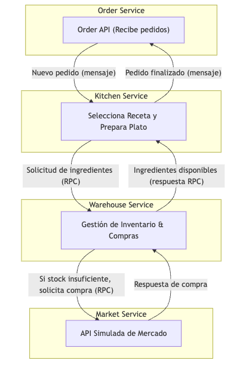
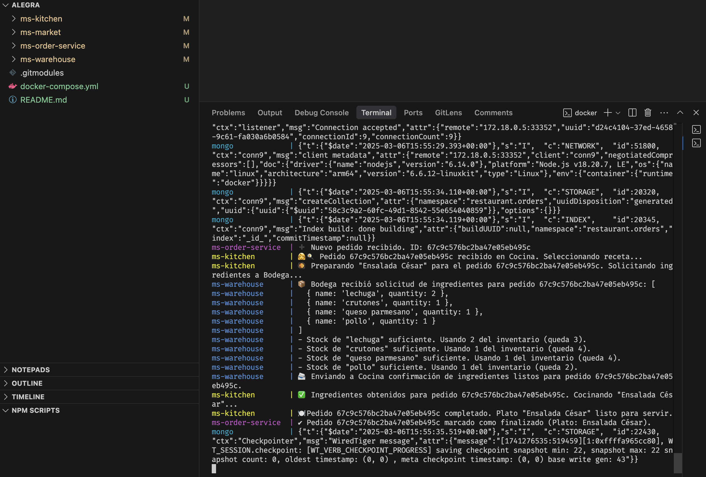

# Proyecto MS Restaurante

Este repositorio contiene el host de los microservicios del ejercicio de Alegra.

## Descripción General

El proyecto cuenta con 5 submódulos o microservicios:

- **ms-order-service:** Se encarga de recibir pedidos del gerente y crearlos.
- **ms-kitchen:** Selecciona una receta para preparar.
- **ms-warehouse:** Administra el inventario de ingredientes.
- **ms-market:** Simula una API externa para la compra de ingredientes.

La comunicación entre estos servicios se realiza a través de RabbitMQ.

## Arquitectura

La solución se basa en una arquitectura de microservicios donde:

- **Comunicación asíncrona:** Se utiliza RabbitMQ para el envío y recepción de mensajes entre los servicios.
- **Persistencia NoSQL:** MongoDB se utiliza para almacenar pedidos, recetas, inventario y el historial de compras.
- **Contenerización:** Cada servicio se ejecuta en su propio contenedor Docker y se orquesta mediante Docker Compose.

Diagrama simplificado de la arquitectura:

Capturas del resultado

## Instrucciones de Uso

Clonar los repositorios 

``git clone --recurse-submodules https://github.com/tu-usuario/orchestrator.git``

# Correr contenedores

``docker-compose up --build``
